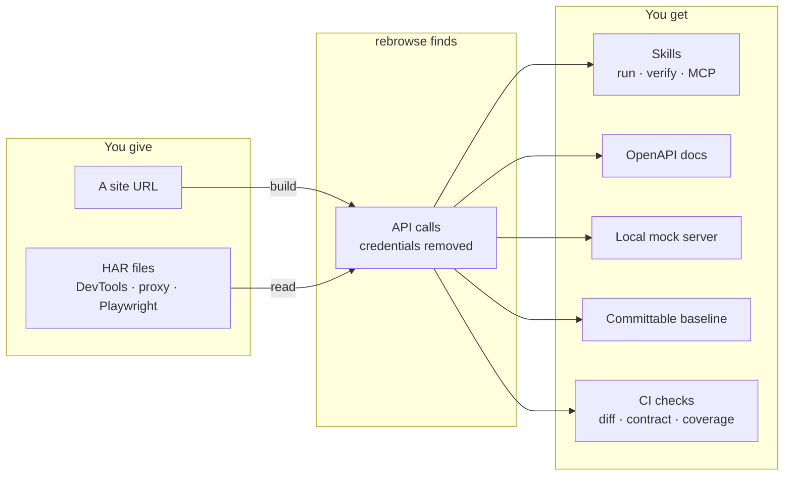
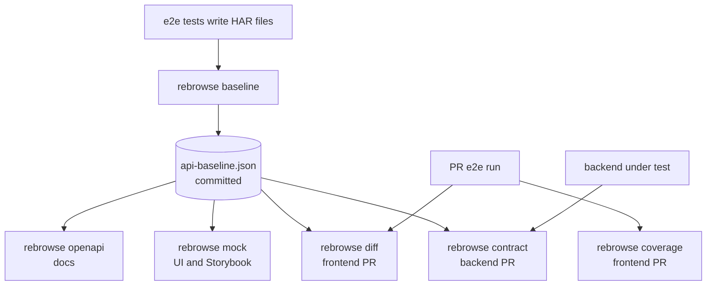

# rebrowse

rebrowse learns the API of a web app from the app's own traffic. Then it uses that API.

You give rebrowse a site or a recording of the site. rebrowse finds the API calls in the
traffic. It turns them into documents, a mock server, safe test data and CI checks. It can
also call the API for you, or for an AI agent.

Private project. No license. All rights reserved.



## What rebrowse does

| Command | Use it to |
|---|---|
| `build <url>` | Open a site in a browser and save its API as a skill |
| `import-har <file or folder>` | Save a skill from HAR files, without a browser |
| `run "<request>"` | Call the saved endpoint that matches a plain-English request |
| `verify <skill>` | Check which read endpoints of a skill still work |
| `skills`, `show`, `delete` | List, search, print and delete skills |
| `auth set`, `auth list`, `auth remove` | Keep API keys. Each key goes only to its own site |
| `mcp` | Give skills to AI agents over MCP |
| `openapi <recording or skill>` | Write an OpenAPI 3.1 document |
| `mock <recording>` | Serve the recorded API on your computer |
| `baseline <recording>` | Write a copy of a recording that is safe to commit |
| `diff <base> <head>` | Find API changes that break the frontend |
| `contract <recording> --against <server>` | Send the recorded reads to a server and judge the answers |
| `coverage <recording>` | Find API calls in the frontend code that no recording made |

All commands write JSON to stdout. They write progress to stderr. They exit with a non-zero
code on an error.

## Two rules that apply everywhere

1. **No secret leaves.** rebrowse removes cookies, tokens, passwords and keys when it reads
   traffic. Reports and documents hold names, paths, statuses and types. They never hold a
   recorded value.
2. **Nothing changes data without you.** rebrowse sends only reads by itself. A write needs
   `--yes` or `confirm=true`. The `verify` and `contract` commands never send a write.

Read [docs/safety.md](docs/safety.md) for the full safety model.

## Install

```bash
python -m venv .venv && .venv\Scripts\activate      # Linux or macOS: source .venv/bin/activate
pip install -e ".[dev,mcp]"
playwright install chromium
cp .env.example .env                                 # then set an LLM provider
```

You need Python 3.11 or later. rebrowse keeps its data in `~/.rebrowse/`. Set
`REBROWSE_DATA_DIR` to use a different folder.

Only `build`, `import-har` and `run` use an LLM. All other commands work offline. Set the LLM
in `.env`:

| `LLM_PROVIDER` | Notes |
|---|---|
| `local` (default) | LM Studio or vLLM at `LLM_BASE_URL` (default `http://localhost:1234/v1`) |
| `ollama` | `http://localhost:11434/v1` |
| `openai`, `gemini`, `claude` | Set `LLM_API_KEY` |

## Quick start 1: call the API of a site

```bash
rebrowse build https://news.ycombinator.com
rebrowse run "top stories on hacker news"
rebrowse run "add a note saying hi" --dry-run   # shows the call, sends nothing
rebrowse run "add a note saying hi" --yes       # sends a call that changes data
rebrowse verify news.ycombinator.com
```

## Quick start 2: use your e2e tests

Record one HAR file for each test. Then do these steps:

```bash
# 1. On main: make a safe baseline and commit it. Do not commit the HAR files.
rebrowse baseline test-results/ -o api-baseline.json

# 2. Make docs and a mock from the baseline.
rebrowse openapi api-baseline.json -o docs/openapi.json
rebrowse mock api-baseline.json

# 3. On a frontend pull request: find changes that break the frontend.
rebrowse diff api-baseline.json test-results/
rebrowse coverage test-results/ --fail-under 80

# 4. On a backend pull request: check the new backend against the frontend's calls.
rebrowse contract api-baseline.json --against http://api:8000 --follow-ids
```



## Documentation

| Page | Read it to learn |
|---|---|
| [Architecture](docs/architecture.md) | How the parts of rebrowse fit together |
| [Recordings](docs/recordings.md) | Which inputs rebrowse reads and what it removes |
| [Skills](docs/skills.md) | `build`, `import-har`, `run`, `verify`, keys and MCP |
| [OpenAPI](docs/openapi.md) | How rebrowse writes API documents |
| [Mock server](docs/mock.md) | How the mock picks an answer |
| [Baselines](docs/baseline.md) | What a baseline keeps and removes |
| [Drift report](docs/diff.md) | Which changes `diff` calls breaking |
| [Contract tests](docs/contract.md) | How `contract` replays reads, with credentials and ids |
| [Accepted changes](docs/accepted.md) | How to accept a breaking change on purpose |
| [Coverage](docs/coverage.md) | How `coverage` finds calls that no test made |
| [CI](docs/ci.md) | A complete CI setup |
| [Safety model](docs/safety.md) | Every safety rule in one place |

## Develop

```bash
pytest                     # uses a local test site and a real headless browser, no internet
ruff check rebrowse tests
```

The tests use a stub LLM and a fixed stand-in for the embedding model. Each test gets its own
data folder.

The `skills/` folder holds notes on skills captured in March 2026 with an earlier version.
rebrowse does not load it.
