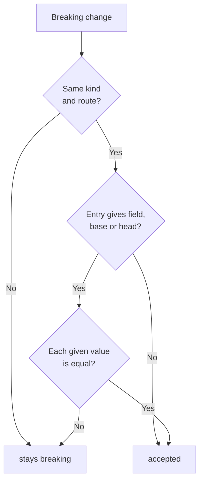

# Accepted changes

Some breaking changes are on purpose. For example, a backend renames `$.total` and the
frontend change ships at the same time. Use an accepted-changes file to let such a change pass.

`--accepted FILE` works with `diff` and `contract`. A change that matches an entry stays in the
report with `"severity": "accepted"` and the reason of the entry. It does not count as breaking.
All other breaking changes still fail the run.

```bash
# On the pull request: accept this run's breaks, then add a reason to each entry and commit.
rebrowse contract api-baseline.json --against http://localhost:8000 \
  --accepted contract-accepted.json --update-accepted

# In CI: read the file. Never write it.
rebrowse contract api-baseline.json --against http://api:8000 --accepted contract-accepted.json
```

```json
[
  {"kind": "field_removed", "route": "GET /api/orders/{orders_id}", "field": "$.total",
   "base": ["integer"], "head": null, "reason": "renamed to totalCents in #412"},
  {"kind": "field_type", "route": "GET /api/users/{users_id}"}
]
```

## How a change is matched



- `kind` and `route` are required. `field`, `base`, `head` and `reason` are optional.
- A change copied from a report works as an entry. `severity` is ignored.
- An unknown key is an error. This catches typos such as `feild`.
- An entry without `field` accepts every field change of that kind on the route.

## What you cannot accept

| Change | Why |
|---|---|
| `no_response`, `blocked` | A timeout or a challenge page is not an API change |
| A status change to a 5xx | It is an outage. A broad `status` entry never accepts it |
| A `field` on `status`, `content_type` or `body_empty` | These change the whole route |
| `route_added`, `route_missing`, added fields | They are info. They never fail a run |

`--update-accepted` also never adds a change where a working route now redirects to sign-in or
answers 401 or 403. Write such an entry by hand if the change is on purpose.

## Stale and unchecked entries

- **stale**: the entry matched no breaking change. The report lists it and stderr warns. Delete
  it, or run with `--update-accepted`. This stops the file from becoming an ignore list.
- **unchecked**: the entry is on a route that the run could not compare, for example a route
  that `contract` skipped. rebrowse keeps it.

## --update-accepted

`--update-accepted` writes FILE from the run:

1. It keeps entries that still match, as written, with their reasons.
2. It keeps unchecked entries.
3. It removes stale entries.
4. It adds each new breaking change as `kind`, `route`, `field`, `base` and `head`.

It does not write the file when the run exits 2, when a replay failed, or when a route answered
with a 5xx. A server that is starting or partly down cannot change the reviewed file. The file
holds names, paths, statuses and types only, and a second run writes the same bytes.

Use one file for each check: one for `diff` and one for `contract`.
