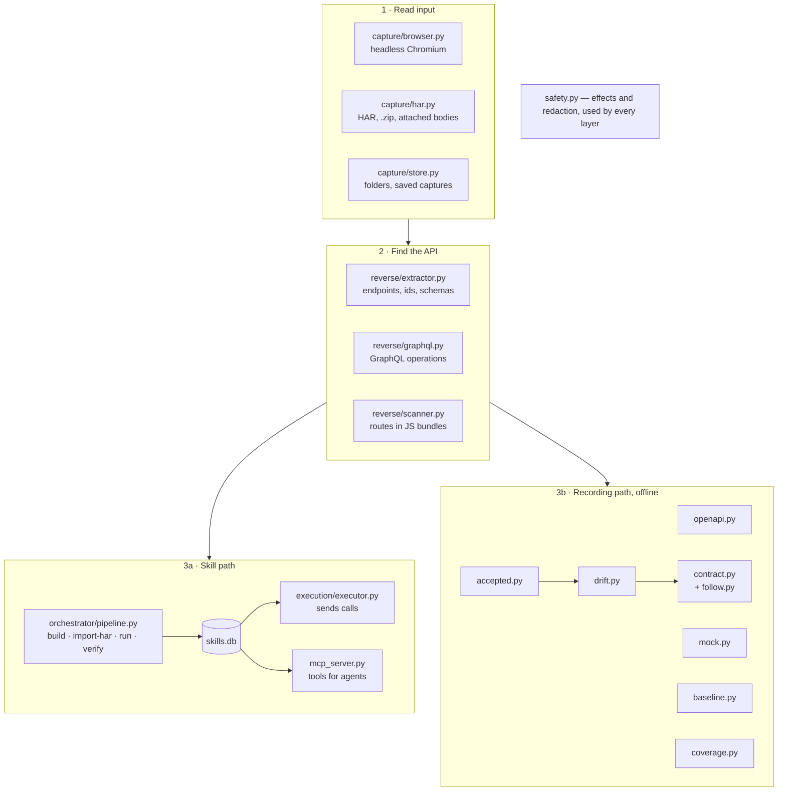

# Architecture

rebrowse has two paths. The skill path saves an API and calls it. The recording path reads
traffic and writes documents, mocks and checks. Both paths use the same reader and the same
safety rules.

## The skill path

1. `build` opens the page. `import-har` reads HAR files.
2. The extractor finds the API calls. It removes credentials first.
3. The LLM writes a short description for each new endpoint.
4. The skill goes into `skills.db`.
5. `run`, `verify` and the MCP server read the skill and send calls through the executor.

## The recording path

1. `capture/store.py` reads a HAR file, a `.zip` archive, a folder or a saved capture.
2. The reader removes credentials as it reads each file.
3. `mock.build_routes` groups the calls into routes. All recording commands use these routes.
4. Each command does its own work: `openapi` writes a document, `mock` serves, `baseline`
   writes a safe copy, `diff` compares two recordings, `contract` replays reads, `coverage`
   scans the frontend code.

The recording path uses no LLM and no network. Only `contract` sends requests, and only to the
server that you name.

## Where rebrowse keeps data

| Path | Holds | Safe to share |
|---|---|---|
| `~/.rebrowse/skills.db` | Skills. No credentials | Yes, in a CI cache |
| `~/.rebrowse/vault/` | Encrypted API keys and cookies, with their key | No |
| `~/.rebrowse/captures/` | Raw traffic from `build` | No |
| `api-baseline.json` (your repo) | A baseline written by `rebrowse baseline` | Yes. Commit it |

Set `REBROWSE_DATA_DIR` to move the `~/.rebrowse/` folder.

## Module map

| Module | Job |
|---|---|
| `capture/` | Browser capture, HAR reading, recording folders, saved captures |
| `reverse/` | Endpoint extraction, GraphQL operations, JS bundle scan |
| `orchestrator/pipeline.py` | `build`, `import-har`, `run`, `verify` |
| `openapi.py` | OpenAPI documents from a skill or a recording |
| `mock.py` | Routes and the mock server |
| `baseline.py` | Committable baselines |
| `drift.py` | Breaking-change rules for `diff` and `contract` |
| `contract.py`, `follow.py` | Replay of reads, and ids from the server's own answers |
| `accepted.py` | Accepted-changes files |
| `coverage.py` | Frontend calls that no recording made |
| `safety.py` | Effects (read, write, destructive) and redaction |
| `execution/`, `auth/`, `net.py` | Sending calls, the key vault, HTTP settings |
| `llm/`, `selection.py` | LLM client and endpoint ranking for `run` |
| `mcp_server.py`, `cli.py` | MCP tools and the command line |
