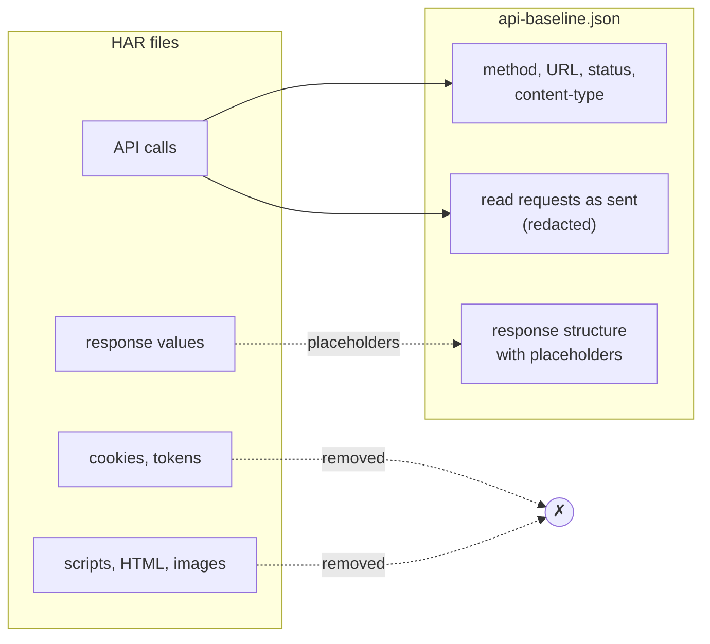

# Baselines

A raw recording is not safe to keep. A HAR file holds the cookies and tokens of the session,
every response value (names, emails, totals) and megabytes of scripts.

`rebrowse baseline SOURCE -o api-baseline.json` writes only what `diff`, `contract` and `mock`
need. The result is a small capture file. Commit it. Do not commit the HAR files.

```bash
rebrowse baseline test-results/ -o api-baseline.json
rebrowse diff api-baseline.json test-results/
rebrowse contract api-baseline.json --against http://api:8000
rebrowse mock api-baseline.json
```



## What a baseline keeps

- The calls that `diff` compares: same-site API calls, sibling hosts, redirects and 304s.
- The method, URL, status and `content-type` of each call.
- The paths of all requests, and the query values and bodies of reads, as `contract` sends
  them. Ids, search terms and GraphQL variables stay. Review the file before the first commit.
- The structure and field names of response bodies.

## What a baseline removes

- Every header and value that `contract` never sends: credential, tracing and browser headers,
  cache-busters, secret-named values, and token values in the query.
- Calls with a credential in the path.
- Response values. Each value becomes a placeholder of the same JSON type: `""`, `0`, `0.5`,
  `false` or `null`. One exception: an id that a kept read sends, under an id-named key, stays.
  `contract --follow-ids` needs it, and the value is already in the file.
- Map keys that hold values. They become `"0"`, `"1"`, ...
- HTML, XML, text and JSONP bodies.
- Write bodies, except the GraphQL `operationName`, `query` and `extensions`.
- Query values of writes, except those that name or classify the call (`operationName`,
  `action`, `cmd`, `op`, `_method`).
- The page URL. The baseline keeps only the site root.

## Same verdicts

- `diff` reports the same changes for a baseline as for its recording.
- `contract` sends the same requests, when no route has more than three different recorded
  reads.
- `mock` serves the placeholders with the recorded status and `content-type`.

## Stable bytes

rebrowse sorts and removes duplicates in requests, keys and array items. It writes no time,
trace id or cache-buster. The same calls give the same bytes. The pull-request diff of
`api-baseline.json` shows the API change, for example `"total":0` that becomes `"total":""`.
A baseline of a baseline is the same file.
