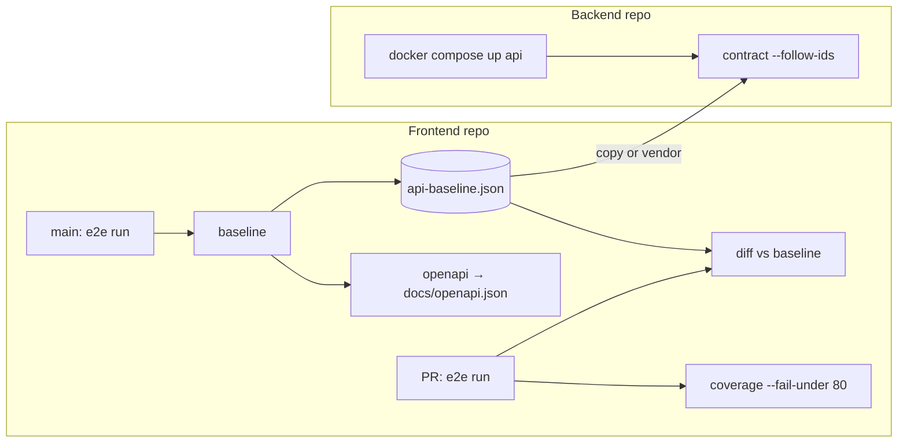

# CI

This page shows one complete setup. The frontend repo records traffic and owns the baseline.
The backend repo uses the baseline to test its own pull requests.



## Frontend repo

```yaml
# On main, after the e2e suite
- run: rebrowse baseline test-results/ -o api-baseline.json   # commit it if it changed
- run: rebrowse openapi api-baseline.json -o docs/openapi.json

# On pull requests
- run: rebrowse diff api-baseline.json test-results/ --accepted diff-accepted.json
- run: rebrowse coverage test-results/ --fail-under 80
```

## Backend repo

```yaml
# On pull requests. Copy or vendor api-baseline.json from the frontend repo.
- run: docker compose up -d --wait api
- run: >-
    rebrowse contract api-baseline.json --against http://api:8000 --follow-ids
    --header-env Cookie=CI_SESSION --accepted contract-accepted.json
  env:
    REBROWSE_HOST_INTERVAL: "0"
    CI_SESSION: ${{ secrets.CI_SESSION }}
```

## Rules

1. Commit `api-baseline.json`. Never commit, cache or upload raw HAR files.
2. Never cache `vault/` or `captures/`. Pull-request jobs can read a cache.
3. Run `--update-accepted` on your own machine, review the file, then commit it. CI only reads
   it.
4. Use one accepted-changes file for each check.
5. Seed the backend with fixtures, or use `--follow-ids`, so detail routes find their data.
6. Get the session for `--header-env` from a CI secret or your own sign-in script. rebrowse
   never signs in.

## Exit codes

| Command | 0 | 1 | 2 |
|---|---|---|---|
| `diff` | no breaking change | breaking change | bad input, no API traffic |
| `contract` | compatible | breaking change or failed replay | bad input, no answer, every read refused |
| `coverage` | done | below `--fail-under` | bad input, no first-party JS |
