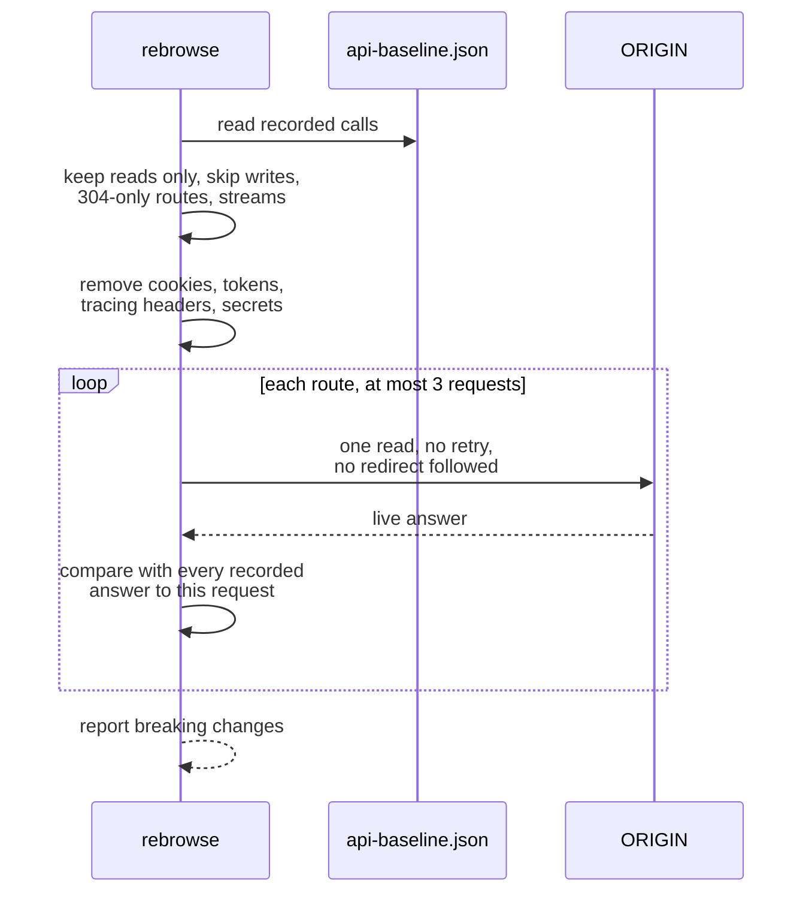
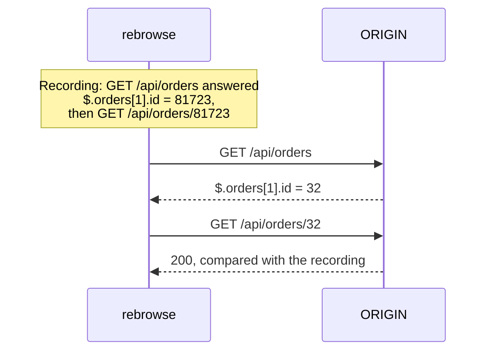
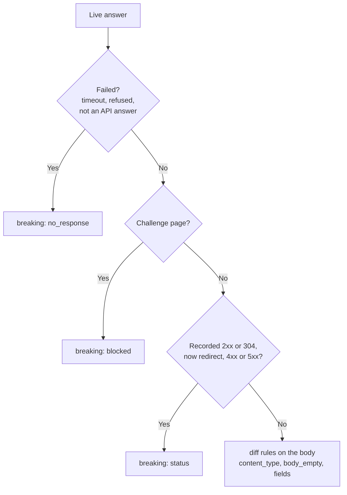

# Contract tests

`rebrowse contract SOURCE --against ORIGIN` answers one question for a backend pull request:
does the changed backend still answer the calls that the frontend makes?

It sends the reads recorded in SOURCE to ORIGIN (`scheme://host[:port]`). It judges the answers
with the rules of [`diff`](diff.md). The traffic of the frontend is the contract. You write no
contract tests by hand.

```bash
docker compose up -d --wait api
REBROWSE_HOST_INTERVAL=0 rebrowse contract api-baseline.json --against http://api:8000 --follow-ids
```

| Exit code | Means |
|---|---|
| 0 | Compatible |
| 1 | A breaking change, or a failed replay |
| 2 | Bad input, no answer at all, or ORIGIN refused every read |

## One run



## What rebrowse sends

- Only reads: GET requests, and GraphQL queries sent by POST with their query text.
- A GraphQL document that defines a mutation anywhere is a write. A query parameter such as
  `action=delete` or `_method=PUT` makes a call a write.
- rebrowse lists writes, 304-only routes, event streams and calls with a credential in the path
  under `skipped`. It never sends them.
- Each route gets at most three different requests, one at a time.
- rebrowse never retries and never follows a redirect. A route that now redirects to `/login`
  is compared as a 302.
- Each request has one deadline and a size limit, so a stream or a large export cannot stop
  the run.
- rebrowse waits between requests to a host that is not localhost. Set
  `REBROWSE_HOST_INTERVAL=0` to turn this off, for example for a CI service called `api`.

## What rebrowse does not send

- Recorded cookies.
- Credential, CSRF, tracing (`traceparent`, `sentry-trace`, `X-Request-Id`, ...),
  conditional (`If-None-Match`, ...) and method-override headers.
- `Origin`, `Referer`, cache-busters and secret-named values.
- Keys stored for the recorded site.

The User-Agent is `rebrowse/<version>`.

## Credentials

A backend behind a sign-in answers every replay with a 302 or a 401. Use `--header-env` to send
a session:

```bash
STAGING_COOKIE="$(./scripts/test-user-session.sh)" rebrowse contract api-baseline.json \
  --against https://staging.app.com --header-env Cookie=STAGING_COOKIE

rebrowse contract api-baseline.json --against http://api:8000 \
  --header-env Authorization=CI_API_TOKEN --header-env X-Tenant=CI_TENANT
```

`--header-env NAME=ENVVAR` sends header NAME, with the value of the environment variable
ENVVAR, on every replay to ORIGIN.

- The value comes only from the environment. It never comes from the command line, so it stays
  out of shell history, process lists and CI logs.
- rebrowse never prints, stores or logs the value. The report lists only the header names,
  under `credentials`.
- The header replaces a recorded header with the same name, and the header of an `auth set`
  key for ORIGIN.
- You cannot set `Host`, `User-Agent` or framing headers.
- rebrowse never signs in by itself. Your own script or CI secret gets the session.

## Ids from the server's own answers

A recording from staging asks for staging data: `/api/orders/81723`, `?userId=4410`, a GraphQL
`$id`. A CI backend with its own fixtures answers 404 to each. `--follow-ids` fixes this.



1. rebrowse finds, in the recording, the earlier read whose answer held each id.
2. It sends that read to ORIGIN first.
3. It takes the id from the same place in the answer of ORIGIN. If the list of ORIGIN is
   shorter, it takes the first item.
4. It sends the dependent read with that id.

Rules:

- Ids come from path segments, id-named query parameters (`userId`, `order_id`) and id-named
  JSON body fields such as GraphQL variables.
- An answer field counts only under an id-named key (`id`, `uuid`, `...Id`, `..._id`). It never
  counts under a secret-named key.
- When two different reads hold the same id equally well, rebrowse does not follow it. It never
  sends a wrong id.
- When ORIGIN does not answer with an id, rebrowse skips the read as `id not found on target`.
  It never sends a guessed id. stderr counts these routes.
- A changed request must still be a read of the same route. A value such as `../admin` is never
  sent.
- The report lists each traced id under `followed`: route, place, name, source route and field.
  It never lists a value.

Without `--follow-ids`, stderr says how many routes answered 404 or 410 for ids that a recorded
answer held.

## Judging



- rebrowse compares each live answer with every recorded answer to the same request. The order
  of the recording does not matter.
- A status that the recording already has for the same request never breaks, for example
  `/api/me` recorded as 401 before sign-in. A 5xx is the exception: a request recorded as 500
  and then 200 fails when ORIGIN answers 500.

## Refused runs

When ORIGIN refuses (401, 403) or redirects every read that the recording answered, the run
exits 2. You get one error instead of many breaking changes. The error names the credentials
sent: the `--header-env` headers and variables, or the `auth set` key. Typical causes are an
expired session, a secret from another environment, or an http ORIGIN that redirects to https.
`--update-accepted` never writes in this case.

## Limits

- Without `--follow-ids`, the recorded ids must exist on ORIGIN.
- With `--follow-ids`, an id that no replayed read held is sent as recorded.
- A field is required when every replayed recording has it. Different fixture data can make an
  optional field look removed.
- Only reads are replayed. Changes to writes are not tested.
- rebrowse sends secret-named values redacted. A call that needs one, such as `pageToken`,
  usually answers 400.
