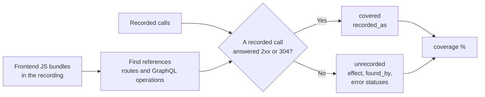

# Coverage

Docs, mocks, baselines and contract runs cover only the calls that a recording made.
`rebrowse coverage SOURCE` finds the API calls that the frontend code can make but that no
recording made. Use it to know which flows to record next.

```bash
rebrowse coverage test-results/                   # what the e2e suite never called
rebrowse coverage test-results/ --fail-under 80   # CI: exit 1 below 80%
```

Run it on the folder of the whole suite. One test covers only a small part of the routes that
a shared bundle names.



## What coverage finds

- `fetch`, `axios` and `.get/.post/.put/.patch/.delete` calls, with a string or a template path.
  `` api.delete(`/api/items/${id}`) `` becomes `DELETE /api/items/{id}`.
- `/api/...` and `/vN/...` strings.
- Paths under prefixes that the recording used, such as `/rest/...` or `/ajax/get_cart.php`.
- GraphQL operations in documents (`` gql`query GetCart($id: ID!) {` ``) and in precompiled
  ASTs.

Coverage ignores:

- static files (`.js`, `.css`, images, fonts, `.txt`, `.yml`, ...) and telemetry;
- an axios `baseURL` string;
- paths that are only placeholders, such as `` `/${resource}/${id}` ``;
- text such as `"query returned {count} results"`.

## How coverage matches

| Reference | Matches |
|---|---|
| `api.get("/orders/summary")` | `GET /api/v2/orders/summary` (the end of the route) |
| `/api/users/{id}` | any recorded id |
| `/api/users/me` | only `/api/users/me` |
| `/api/teams` | `/api/teams/` too |
| a GET or `fetch()` | any method |
| `.post`, `.put`, `.patch`, `.delete` | only that method |
| a GraphQL operation | calls with the same operation name |

A reference is covered when a matching call answered with a 2xx or a 304. A route recorded only
with a 401, a redirect or a 500 stays unrecorded. The report shows those statuses.

## The report

| Field | Holds |
|---|---|
| `bundles` | The number of bundles scanned |
| `referenced` | The number of routes and operations found |
| `coverage` | The percent that a recording answered |
| `unrecorded` | Each missing reference: `effect`, `found_by`, bundle URL, error `statuses` |
| `covered` | Each covered reference and the routes that answered it (`recorded_as`) |
| `unreferenced` | Recorded routes that no reference matched, such as URLs built at run time |

Coverage never prints bundle source. It sends nothing and uses no LLM.

## Limits

- A baseline keeps no JS. Run coverage on the HAR files the baseline came from.
- A capture from `build` keeps at most 20 scripts. HAR files keep all of them.
- Coverage cannot see URLs from runtime config, relative paths, persisted-only GraphQL, lazy
  chunks that the recording never loaded, or a method set in `fetch(url, {method})` options.

| Exit code | Means |
|---|---|
| 0 | Done |
| 1 | Coverage is below `--fail-under` |
| 2 | Bad input, no first-party JS, or JS with no API reference |
