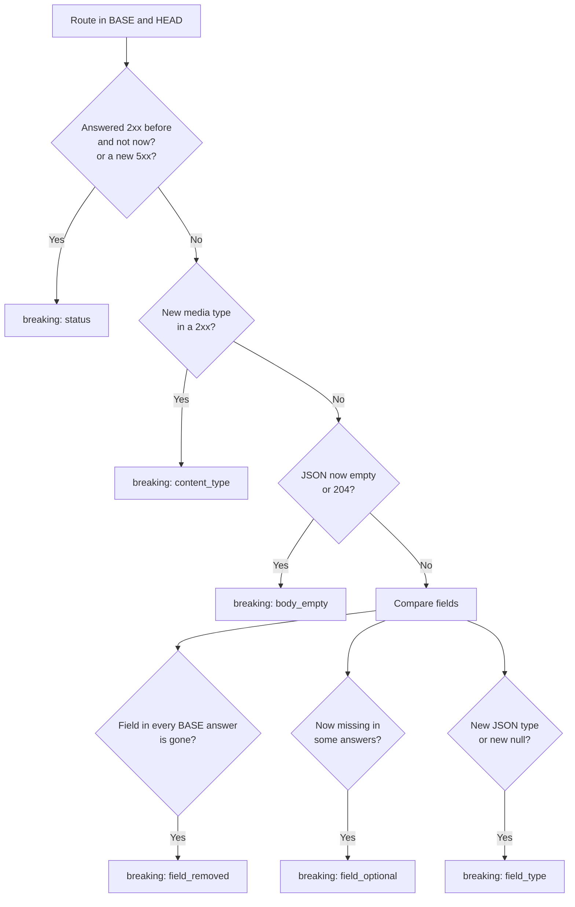

# Drift report

`rebrowse diff BASE HEAD` compares two recordings of the same app. It reports the changes that
can break the frontend. It needs no spec, no LLM and no network.

```bash
rebrowse diff api-baseline.json test-results/
rebrowse diff prod.har staging.har -d prod.app.com -d staging.app.com   # one --domain per side
```

| Exit code | Means |
|---|---|
| 0 | No breaking change |
| 1 | A breaking change that is not [accepted](accepted.md) |
| 2 | Bad input, or a side with no API traffic (for example a run that did not get past sign-in) |

## Breaking or info



| Kind | Breaking when | Example |
|---|---|---|
| `status` | A route that answered 2xx no longer does, or starts a 5xx | `GET /api/me` now redirects to `/login` |
| `content_type` | A 2xx comes with a media type BASE never sent | JSON became HTML |
| `body_empty` | JSON became an empty body or a 204 | |
| `field_removed` | A field in every BASE answer is gone | `$.total` |
| `field_optional` | A field in every BASE answer is missing from some HEAD answers | |
| `field_type` | A field has a new JSON type, also a new `null` | `["string"]` → `["null", "string"]` |

These changes are info, and never fail the run:

- other status changes;
- added fields;
- removed fields that BASE did not always send;
- routes on one side only (`route_added`, `route_missing`);
- `number` where BASE had `integer`. JavaScript cannot see the difference.

## Routes and fields

- Ids become templates. `/api/users/1001` and `/api/users/42` are one route.
- Each GraphQL operation is its own route. Each sibling host is its own route.
- A 304 counts as an answer.
- rebrowse reads fields from 2xx JSON bodies, also behind an XSSI guard, down to 12 levels.
- Map keys that hold values (ids, emails, dates, tokens such as `ghp_...`) are compared
  together under `.*`, as in `$.members.*.role`.

## The report

The report holds each side's source, domain and route counts, the number of breaking changes,
and the changes. It holds route names, statuses, media types, field paths and JSON types. It
never holds a value.

```json
{"severity": "breaking", "kind": "field_type", "route": "GET /api/orders/{orders_id}",
 "field": "$.total", "base": ["string"], "head": ["null", "string"]}
```
