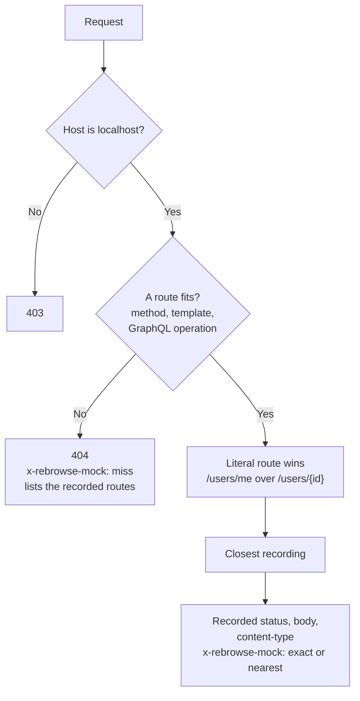

# Mock server

`rebrowse mock SOURCE [-p PORT]` answers the API calls of a frontend from a
[recording](recordings.md). The UI, Storybook or an e2e suite can then run without the real
backend.

```bash
rebrowse mock api-baseline.json   # http://127.0.0.1:8787
rebrowse mock hars/               # the HAR files your Playwright tests replay
rebrowse mock e2e.har -p 0        # 0 picks a free port
```

Point the API base URL of the app, or its dev-server proxy, at the URL that the mock prints.
The mock prints its route table at start. It writes one stderr line for each request.

## How the mock picks an answer



The mock picks the closest recording in this order:

1. a recording that has a body;
2. the same path;
3. the most shared query pairs, then the fewest recorded pairs missing from the request;
4. the most shared top-level body fields (so `action=save_post` gets the `save_post`
   recording of an RPC endpoint);
5. the same body;
6. a 2xx before an error.

An unseen id gets an answer from its template: `/api/users/999` gets the recorded
`/api/users/1001`. Each GraphQL operation is its own route, also persisted queries and GET
`?query=`. A batch fits only the same operations in the same order. An unrecorded GraphQL
operation is a miss. It never gets the data of another operation.

## What the mock sends

- The recorded status, the body as UTF-8, and `content-type`. No other recorded header, so no
  `Set-Cookie`.
- `x-rebrowse-mock: exact` or `nearest`, and `x-rebrowse-route`.
- JSON values under secret-looking keys become `<redacted>`. This also works behind a BOM, an
  XSSI guard or a JSONP callback. Form-encoded bodies are redacted pair by pair.

## Safety

- The mock has no HTTP client. It never sends a request to the real site.
- The mock keeps no state. A POST gets its recorded answer and changes nothing.
- The mock binds to 127.0.0.1 only. It refuses a `Host` that is not a loopback name, to stop
  DNS rebinding.
- CORS answers only `localhost`, `127.0.0.1` and `[::1]` origins. The mock refuses cross-site
  requests from other pages, so another website cannot read it with a `<script>` tag.
