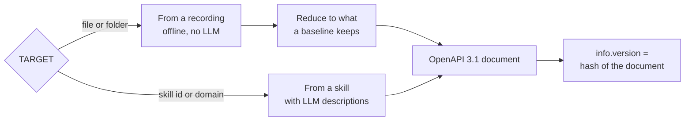

# OpenAPI

`rebrowse openapi TARGET [-o FILE]` writes an OpenAPI 3.1 JSON document. Swagger UI and Redoc
can show it. Prism can mock it. Schemathesis can test it.

TARGET can be a [recording](recordings.md) or a skill. A recording wins over a skill with the
same name.



Every operation has `x-rebrowse-effect` (`read`, `write` or `destructive`). Use it to run
tests on reads only. `info.version` is a hash of the document, not a time. It changes only when
the document changes.

## From a recording

```bash
rebrowse openapi session.har -o api.json
rebrowse openapi api-baseline.json -o docs/openapi.json && git diff --exit-code docs/openapi.json
```

rebrowse uses no LLM, no skill and no `skills.db` for this. Nothing goes over the network.

- **Same bytes.** rebrowse first reduces the recording to what a [baseline](baseline.md) keeps.
  A HAR file, a folder and the baseline from them give the same document, byte for byte. A new
  recording of the same calls to an unchanged API gives the same document too.
- **Operations** are the routes that `diff` compares, with redirects and 304s. A path on a
  sibling host lists its hosts under `servers`. GraphQL operations at one URL become one
  operation. `x-rebrowse-graphql` names them, and each one has its own request example.
- **Parameters.** A query or header parameter is required when every recorded call sent it.
- **Responses.** Each recorded status is its own response. A route that answered 200, 404 and a
  302 to sign-in has all three. A status outside 100–599 becomes `default`. 204, 205, 304 and
  responses with no content type have no content. A body that is not JSON shows only its
  media type.
- **Schemas** follow the rules of `diff`, down to 12 levels. A field is `required` when every
  recorded object at its place had it. That is the rule by which `diff` and `contract` call a
  removal breaking.
- **Types.** `integer` becomes `number` when both appear. A field seen as a string and as null
  is `["null", "string"]`.
- **Map keys.** Keys that hold values, such as ids, emails, dates and tokens, become
  `additionalProperties`. They never become property names.
- **No values.** Responses hold schemas only. Request examples come from the baseline: read
  bodies keep their (redacted) values, and write bodies hold placeholders. A JSON body sent as
  `text/plain` gets a schema like any JSON body.

## From a skill

The skill export adds:

- the LLM descriptions;
- routes found only in JS bundles, with `x-rebrowse-observed: false`;
- `verify` health, in `x-rebrowse-verification`.

The skill export is byte-stable in one data folder, because learning again keeps descriptions.
A new `~/.rebrowse` gives a new skill id and new descriptions. In CI, document the committed
baseline instead, or cache only `$REBROWSE_DATA_DIR/skills.db`. Never cache `vault/` or
`captures/`.
