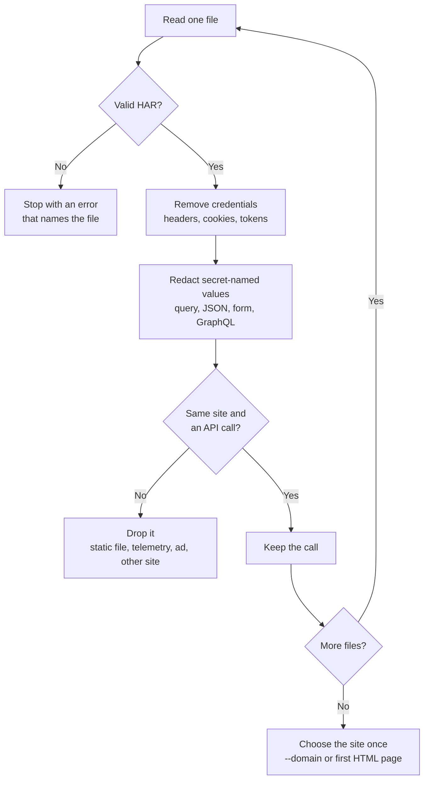
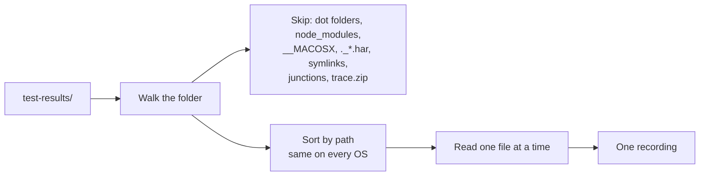

# Recordings

A recording is traffic that rebrowse reads. The commands `openapi`, `mock`, `baseline`, `diff`,
`contract`, `coverage` and `import-har` all read recordings in the same way.

## Inputs

| Input | Example | Notes |
|---|---|---|
| A HAR file | `session.har` | From DevTools "Save all as HAR", mitmproxy, Charles, Proxyman or Playwright |
| A Playwright HAR archive | `network.zip` | A zip with `har.har` and one file per body |
| A HAR with attached bodies | `hars/app.har` + `hars/<sha1>.json` | Written by `routeFromHAR(..., { update: true })` or `content: 'attach'` |
| A folder | `test-results/` | Every HAR file and HAR archive in it, read as one recording |
| A saved capture or a baseline | `api-baseline.json` | Written by `build` or by `rebrowse baseline` |
| A host | `localhost:8080` | The newest capture that `build` saved for that host |

## What the reader does



### What the reader removes

The reader removes these items before rebrowse stores, serves or sends anything:

- `Cookie`, `Set-Cookie`, `Authorization`, API-key, CSRF and session headers.
- Headers whose value looks like a credential, such as `Bearer ...` or a JWT.
- The cookie lists in the HAR.
- User names and passwords in URLs.
- Secret-named path parameters, such as `;jsessionid=`.
- OAuth `code` values and CAS `ticket` values.

The reader replaces values with secret-looking names (`password`, `token`, `api_key`,
`session`, `csrf`, SAML assertions) with `<redacted>`. This also applies inside JSON-encoded
values such as GraphQL `variables`, and to secret-named arguments in GraphQL documents.

The reader treats a body that parses as JSON as JSON, whatever its declared type. It drops
multipart, XML and binary request bodies, because it cannot redact them.

## Choose the site

Use `--domain host[:port]` to pick the site. You can give a bare host, `host:port` or a URL, in
any case. If you give no `--domain`, rebrowse uses the host of the first HTML page.

rebrowse keeps calls to sibling hosts of the same site, such as `api.app.com` next to
`www.app.com`. It names them with their host. For a saved capture, `--domain` can move to a
sibling host.

## Read a folder

An e2e suite usually writes many HAR files. Playwright gives each test its own browser context.
Parallel workers write their own files. Give rebrowse the folder:

```bash
rebrowse baseline test-results/ -o api-baseline.json
rebrowse diff main-hars/ pr-hars/
```



Rules for a folder:

1. rebrowse reads every `.har` file, in any case and at any depth.
2. rebrowse reads every `.zip` file that holds a `har.har` entry. It skips other zip files.
3. rebrowse reads the files in order of their path, with `/` as separator. The order is the
   same on every OS.
4. rebrowse reads one file at a time, so memory holds only one raw HAR.
5. rebrowse reads a script that is in many files only once.
6. `baseline` and `openapi` sort their output. File names do not change the result.

rebrowse stops with an error, and writes nothing, when it finds:

- a folder with no HAR file;
- a HAR file or archive that is not valid JSON or HAR, for example a file that a crashed test
  cut short;
- an empty or damaged `.zip` file;
- a body file that a HAR names but that is missing;
- a Git LFS pointer instead of a recording (run `git lfs pull`);
- an empty source argument. rebrowse never reads the current folder by accident.

stderr shows one line, for example `[baseline] read 14 HAR files under test-results`.

## Record one HAR file for each test

Playwright Test:

```ts
// fixtures.ts. Specs import { test, expect } from './fixtures'
import { test as base } from '@playwright/test';

export const test = base.extend({
  contextOptions: async ({ contextOptions }, use, testInfo) => {
    await use({ ...contextOptions, recordHar: { path: testInfo.outputPath('network.har') } });
  },
});
export { expect } from '@playwright/test';
```

Use `testInfo.outputPath('network.zip')` to write a HAR archive.

pytest-playwright:

```python
# conftest.py
import re

import pytest


@pytest.fixture
def context(browser, browser_context_args, request):
    name = re.sub(r"[^\w.-]+", "-", request.node.nodeid)
    context = browser.new_context(**browser_context_args,
                                  record_har_path=f"test-results/{name}/network.har")
    yield context
    context.close()  # writes the HAR
```

## Attached bodies

Playwright can write each body to its own file next to the HAR. The HAR names the file in
`_file`. rebrowse reads these files. If a body has both a file and embedded text, rebrowse uses
the file, like Playwright does.

Keep the body files with the HAR. rebrowse stops with an error when a JSON, text, request or
script body file is missing. It refuses a `_file` that is not a plain file in the HAR's own
folder, such as a path or a symlink.
