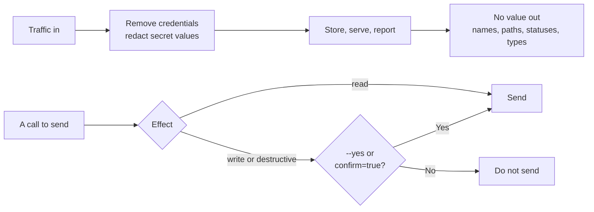

# Safety model

rebrowse reads real traffic and can send real requests. These rules apply to every command.

## Effects

rebrowse labels every call as `read`, `write` or `destructive`. It uses:

- the method (`DELETE` is destructive);
- verbs in the path (`/comment/destroy` over GET is destructive);
- action-style query parameters (`?action=delete`, `?_method=PUT`);
- the GraphQL operation (a document that defines any mutation is a write).

## Confirmation

- rebrowse sends only reads by itself.
- A write or destructive call needs `--yes` (CLI) or `confirm=true` (MCP `act`).
- rebrowse never retries a write. A write that timed out can already be done.
- `verify` and `contract` never send a write.

## Honest identity

The capture browser is not disguised. Replays send `rebrowse/<version>` as User-Agent. They do
not copy a browser fingerprint.

## Blocks are failures

A challenge page (Cloudflare "Just a moment…", a robot-policy 403, a CAPTCHA) is a `blocked`
failure. rebrowse never returns it as data. rebrowse has no bypass logic.

## Credentials stay in their place

- A stored key or cookie goes only to its own site.
- rebrowse removes stored credentials from any redirect that leaves the site.
- rebrowse never reads the cookie store of your browser.
- rebrowse never signs in. You give it a session with `--header-env` if you want.
- `--header-env` values come only from the environment. rebrowse never prints or stores them.
- rebrowse waits between requests to the same host (`REBROWSE_HOST_INTERVAL`, default 1 second).
- rebrowse refuses to send an LLM API key over plain HTTP to a host that is not local.

## No value goes out

- The reader removes credentials as it reads. See [Recordings](recordings.md#what-the-reader-removes).
- Reports, accepted-changes files and documents hold route names, field paths, statuses and
  types. They never hold a recorded or live value.
- A baseline replaces response values with placeholders.
- The mock binds to localhost only and answers no other site.
- The LLM sees method and URL template only, never recorded values.

## Errors instead of silent data loss

rebrowse stops with an error, and writes nothing, when a recording is broken: a cut-short HAR,
a damaged zip, a missing body file, a Git LFS pointer, an empty source. A broken input never
makes a baseline smaller without a word.
