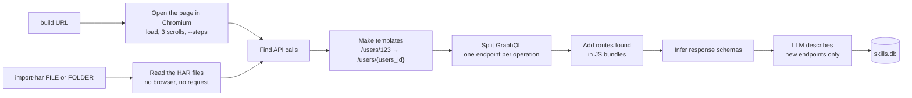
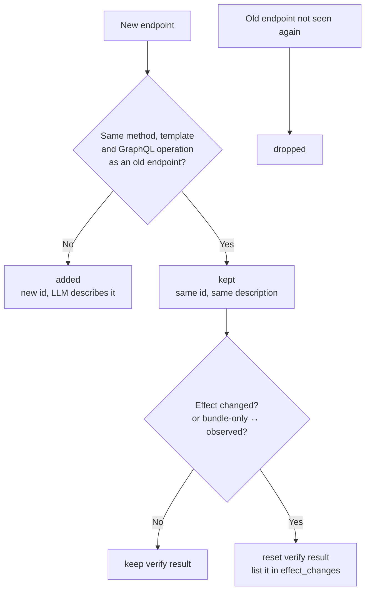
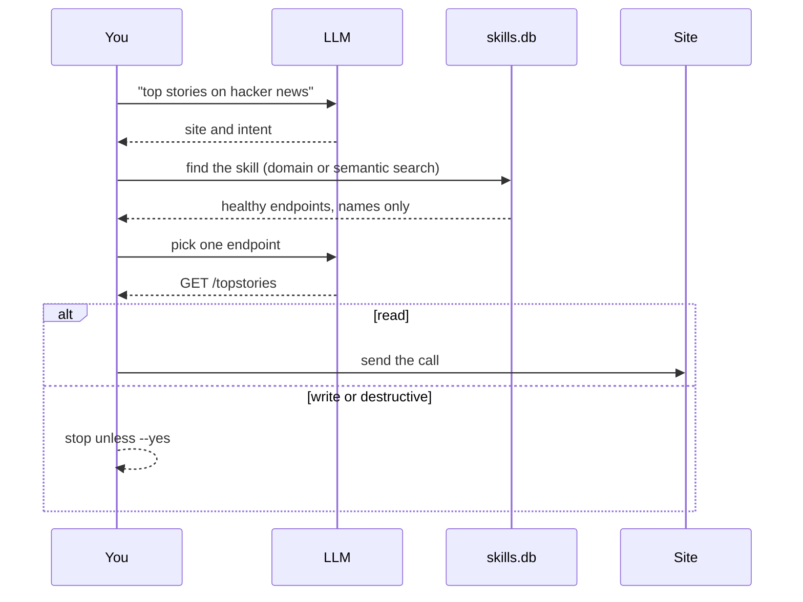

# Skills

A skill is the saved API of one site. It lives in `skills.db`. Each endpoint in a skill has:

- a method and a URL template, such as `GET /users/{users_id}`;
- its parameters and a request template;
- a response schema;
- an effect: `read`, `write` or `destructive`;
- a short description from the LLM;
- a `verify` result.

## Make a skill



### build

`rebrowse build <url>` opens the page in headless Chromium. It records every response while the
page loads, while it scrolls three times, and during any `--steps`:

```bash
rebrowse build https://example.com --steps "type #q=shoes; click #search; wait 800"
```

Then `build`:

1. keeps same-site API calls, and drops static files, telemetry, ads and other sites;
2. makes URL templates from ids, and removes duplicates;
3. makes one endpoint for each GraphQL operation, including persisted queries and GET
   `?query=`;
4. scans first-party JS bundles for routes that the page did not call, and takes the method
   from the call (`axios.post(...)` is a POST);
5. infers a response schema from all samples. A field in every sample is required;
6. saves the raw capture in `captures/`, so you can read it again without a browser.

The telemetry filter looks at whole path segments. `/api/login` stays. `/log` goes.

### import-har

`rebrowse import-har <file or folder>` makes the same kind of skill from
[recordings](recordings.md). It opens no browser and sends no request. Use it for the parts of
an app that need a sign-in: sign in yourself, use the app, and save the HAR file.

rebrowse uses response bodies only to infer schemas. It copies nothing to `captures/`. To read
the HAR again, import it again.

## Learn a site again

When you build or import a site again, rebrowse updates its skill. It keeps what did not change.



- Ids stay the same, so ids that you gave to agents still work.
- The LLM describes only endpoints with no description, at most 25 in one run. A large app
  gets the rest in later runs.
- An LLM outage does not fail the build. Endpoints are saved without a description.
- Request templates, examples and schemas always come from the new recording.
- The output lists `changes` (`added`, `kept`, `dropped`, `described`), the `change` of each
  endpoint, the `dropped` endpoints and any `effect_changes`.

To get new descriptions, delete the skill and build it again. This also resets ids and
`verify` results.

## Call a skill



`rebrowse run "<request>"`:

1. The LLM finds the site and the intent.
2. rebrowse finds the skill by domain or by semantic search. Below 0.25 similarity it stops. It
   does not guess.
3. The LLM picks one endpoint from the healthy endpoints. It sees parameter names only, never
   recorded values. The endpoint list is marked as untrusted data.
4. rebrowse sends a read. A write or destructive call needs `--yes`. `--dry-run` shows the call
   and sends nothing.

## Check a skill

`rebrowse verify <skill>` sends each read endpoint again. It records `verified` or `failed` and
a reliability score. `run` skips failed endpoints and ranks the others. A read that redirects
to an HTML sign-in page is `auth_required`, not verified. `verify` never sends a write.

## Manage skills and keys

| Command | Does |
|---|---|
| `rebrowse skills [-q "search"]` | Lists or searches skills |
| `rebrowse show <id>` | Prints a skill as JSON |
| `rebrowse delete <id>` | Deletes a skill |
| `rebrowse auth set <domain> <key> [--type bearer\|header\|query]` | Stores an API key in the encrypted vault |
| `rebrowse auth list` | Lists domains with keys |
| `rebrowse auth remove <domain>` | Removes a key |

A key goes as `Authorization: Bearer`, `X-API-Key` or `?api_key=`. It goes only to its domain
and to same-site hosts. rebrowse never imports cookies from a HAR, so `run` and `verify` cannot
use a session cookie. `contract` can, with [`--header-env`](contract.md#credentials).

## MCP

`rebrowse mcp` gives skills to AI agents over stdio:

```json
{ "mcpServers": { "rebrowse": { "command": "rebrowse", "args": ["mcp"] } } }
```

| Tool | Does | MCP hint |
|---|---|---|
| `search_skills` | Finds skills | read-only |
| `list_operations` | Lists the endpoints of a skill | read-only |
| `read` | Sends a read endpoint. Refuses anything else | read-only |
| `act` | Sends a write or destructive endpoint. Returns `confirmation_required` until `confirm=true` | destructive |
